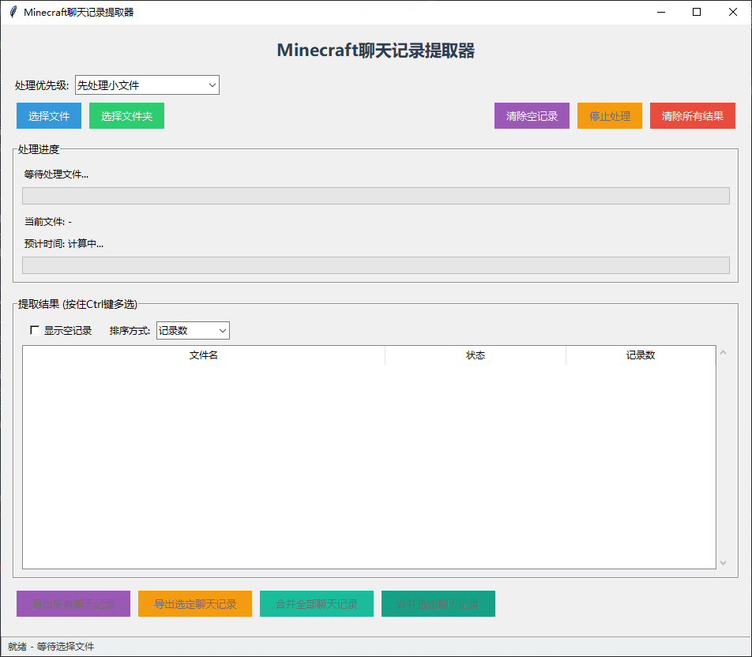

# 🎮 Minecraft 聊天记录提取器

> 一个强大的工具，专门用于提取、分析和导出 Minecraft 服务器的聊天记录，支持多种日志格式和智能编码处理。



## 📦 功能亮点

### 🔍 智能编码处理
- **自动编码检测**：智能识别常见编码格式
- **乱码自动修复**：检测并修复文件中的乱码问题
- **BOM头识别**：自动识别带 BOM 头的文件进行编码检测
- **多服务端支持**：支持提取Minecraft Forge/Fabric/原版服务端 所产生的log文件

### ⚡ 高效性能
- **大文件优化**：专为处理日志文件设计
- **多线程处理**：并行处理多个文件，提高效率
- **实时进度监控**：显示详细处理进度和预计时间

### 💾 灵活输出
- **多种导出选项**：
  - 导出单个文件聊天记录
  - 导出选定文件聊天记录
  - 导出所有聊天记录
- **合并功能**：
  - 合并选定聊天记录
  - 合并所有聊天记录
- **冲突处理**：智能解决文件冲突（覆盖/跳过/重命名）

### 🛡️ 安全处理
- **隔离处理环境**：在临时目录操作，不影响源文件
- **自动清理**：处理完成后自动清除临时文件
- **磁盘空间检查**：处理前验证足够磁盘空间

## 📥 安装与运行

### 系统要求
- Python 3.8+
- Windows/Linux

### 安装步骤

```bash
# 克隆仓库
git clone https://github.com/yourusername/Minecraft-Chat-Extractor.git

# 进入项目目录
cd Minecraft-Chat-Extractor

# 安装依赖
pip install -r requirements.txt

# 运行应用
python Minecraft_log_extraction_system.py
